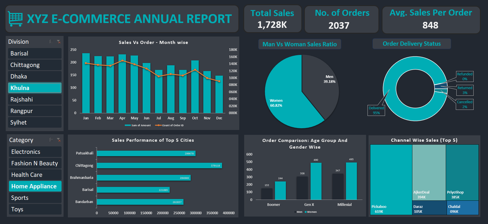

# 📊 E-Commerce Annual Sales Dashboard (Excel BI Report)

> **A dynamic Excel dashboard for analyzing XYZ Limited’s 2024 e-commerce performance with KPIs, interactive charts, and slicers.**

---

## 📖 Project Description
A dynamic **Excel-based Business Intelligence (BI) dashboard** for analyzing the annual e-commerce performance of **XYZ Limited (2024)**.  
The dashboard includes **key KPIs** (Total Sales, Total Orders, Avg. Sales per Order) and **interactive visualizations** such as sales vs orders, gender ratio, delivery status, top cities, and channel-wise sales.  

This project was designed based on a **Business Requirement Document (BRD)** and aims to help decision-makers quickly understand customer behavior, identify trends, and make **data-driven business strategies**.  

---

## 🎯 Business Objectives
- Summarize **Total Sales, Total Orders, and Avg. Sales per Order**  
- Provide insights into **customer behavior** (gender, age, region)  
- Analyze **channel & category performance**  
- Identify **top-performing cities and sales channels**  
- Enable **trend comparisons** across months, divisions, and categories  

---

## 📌 Key Features
- **KPI Cards** → Total Sales, Orders, Avg. Sales per Order  
- **Sales vs Orders (Month-wise)** → Column Chart  
- **Man vs Woman Sales Ratio** → Pie Chart  
- **Order Delivery Status** → Donut Chart  
- **Sales Performance (Top 5 Cities)** → Bar Chart  
- **Orders by Age & Gender** → Column Chart  
- **Channel-wise Sales (Top 5)** → Treemap  
- **Interactive Filters** → Division-wise & Category-wise slicers  

---

## 🖼️ Dashboard Preview


---

## 📂 Project Files
- `Business Requirement Document.docx` → Defines KPIs & requirements  
- `E-Commerce_Annual_Report.xlsx` → Interactive Excel dashboard  
- `Screenshot.png` → Dashboard preview  

---

## 🛠️ How to Use
1. Clone this repository:
   ```bash
   git clone https://github.com/your-username/ecommerce-annual-sales-dashboard.git
